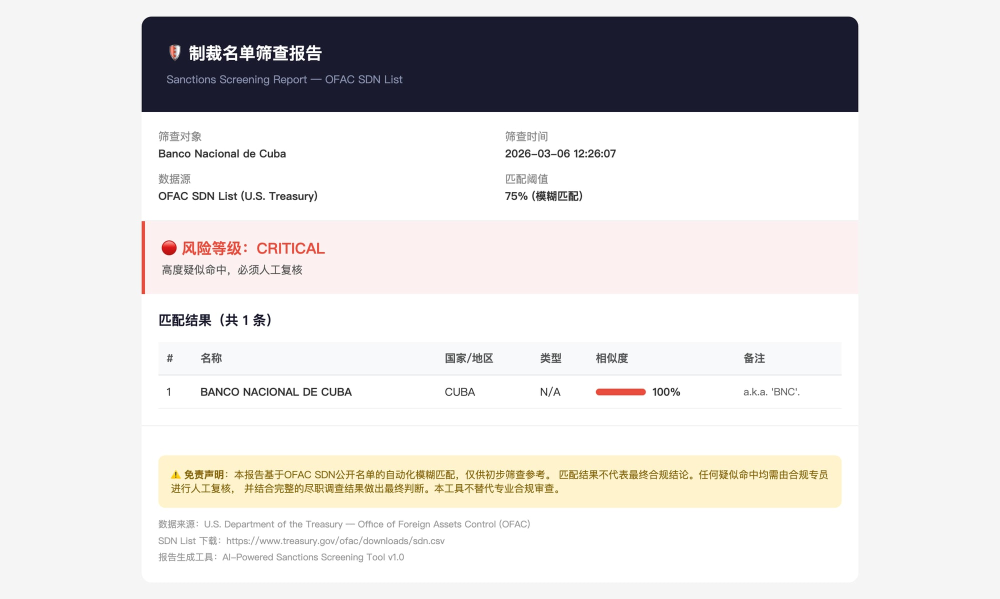
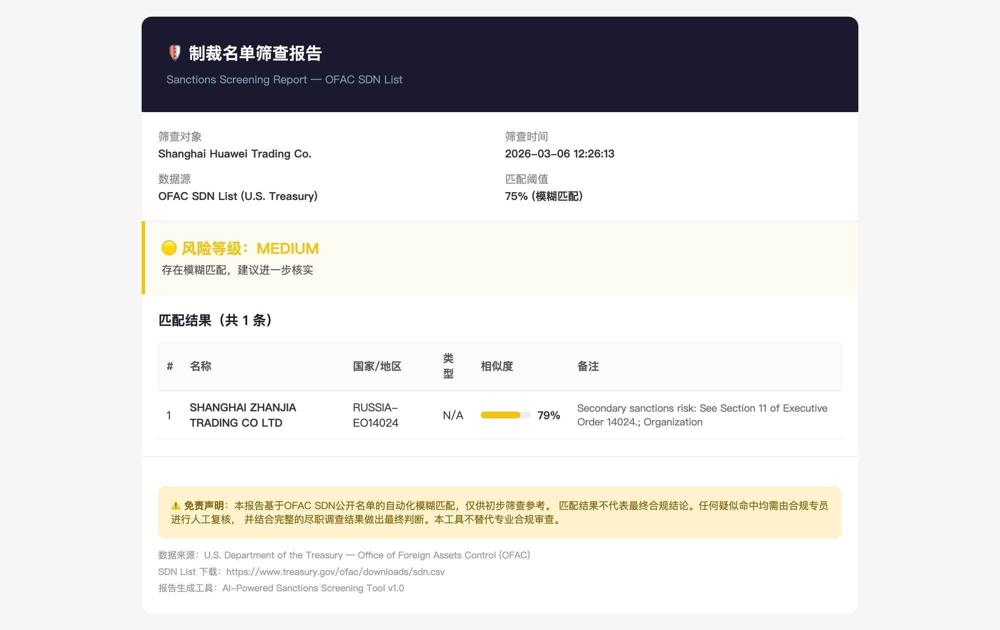
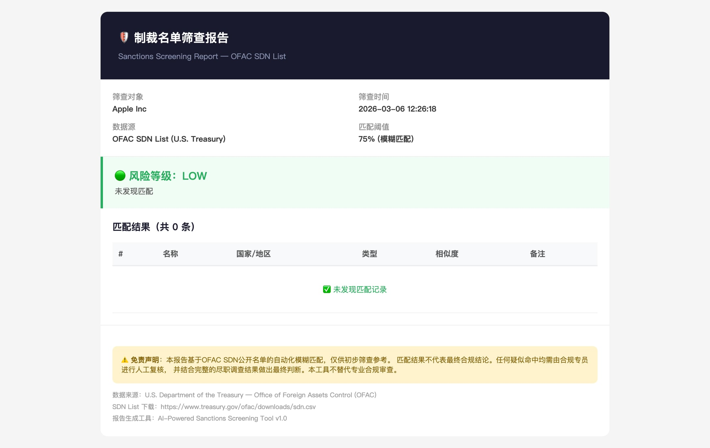

# 🛡️ OFAC Sanctions Screening Tool

A lightweight, open-source sanctions screening tool that checks entities against the **OFAC SDN (Specially Designated Nationals) List** with fuzzy matching — in under 5 seconds.

## Why This Exists

Commercial sanctions screening tools cost **$10,000–$100,000+/year**. Small and mid-size trading companies often can't afford them, leaving compliance gaps that could result in **millions in fines**.

This tool provides **free, instant sanctions screening** with professional-grade HTML reports.

## Features

- 🔍 **Fuzzy Matching** — Catches spelling variants and aliases (not just exact matches)
- 📊 **18,700+ SDN Records** — Full OFAC Specially Designated Nationals list
- 📄 **Professional HTML Reports** — Print-ready, with risk levels and audit trail
- ⚡ **< 5 seconds** — From query to report
- 🚀 **Zero Dependencies** — Pure Python, no installation needed
- 🌐 **Bilingual** — Chinese/English report output

## Risk Levels

| Level | Meaning | Action |
|-------|---------|--------|
| 🔴 **CRITICAL** | ≥95% match | **Mandatory manual review** |
| 🟠 **HIGH** | 85-94% match | Recommended review |
| 🟡 **MEDIUM** | 75-84% match | Further verification suggested |
| 🟢 **LOW** | No match | Passed |

## Quick Start

```bash
# Clone
git clone https://github.com/bigdong1991-spec/ofac-sanctions-screening.git
cd ofac-sanctions-screening

# Download latest OFAC SDN list
curl -sL "https://www.treasury.gov/ofac/downloads/sdn.csv" -o sdn.csv

# Screen an entity
python3 screen.py "Banco Nacional de Cuba"
```

Output: an HTML report file in the current directory.

## Demo Results

### 🔴 CRITICAL — Direct Hit (100%)


### 🟡 MEDIUM — Fuzzy Match (79%)


### 🟢 LOW — Clean (0%)


## How It Works

1. **Load** — Parses the full OFAC SDN CSV (18,700+ entities)
2. **Match** — Runs fuzzy string matching (SequenceMatcher) against all entries + aliases
3. **Score** — Calculates similarity percentage for each potential match
4. **Report** — Generates a styled HTML report with risk classification

## Data Source

- **OFAC SDN List**: [U.S. Treasury — Office of Foreign Assets Control](https://www.treasury.gov/ofac/downloads/sdn.csv)
- Updated regularly by the U.S. Department of the Treasury
- To update: re-download `sdn.csv` from the link above

## Roadmap

- [ ] Batch screening (CSV/Excel upload)
- [ ] EU & UN sanctions lists
- [ ] Auto-update SDN data (weekly cron)
- [ ] REST API endpoint
- [ ] Audit log with operator tracking

## ⚠️ Disclaimer

This tool is for **preliminary screening only**. Results do not constitute final compliance conclusions. Any potential matches must be reviewed by a qualified compliance officer with full due diligence. This tool does not replace professional compliance review.

## License

MIT

---

Built by a trade compliance professional who got tired of manual screening.
